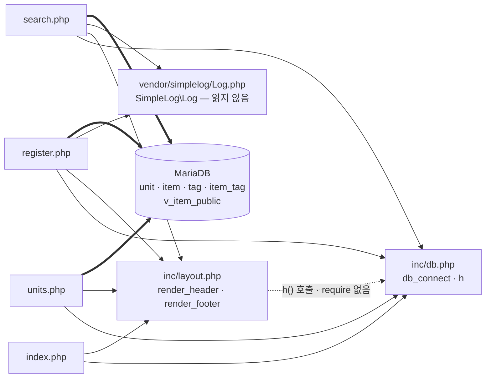

# item-bank-php 아키텍처

> 대상: `legacy/item-bank-php` · 분석 범위: 진입점 · 의존 관계 · 분석일: 2026-09-29
> `vendor/` 는 외부 라이브러리라 읽지 않았다. 근거는 `파일:줄번호` 이며 경로는 `legacy/item-bank-php/` 기준이다.

## 1. 모듈 개요

- 문항(item)을 검색 · 등록하고 단원별 공개 문항 수를 보여 주는 내부용 PHP 웹 화면이다 (`index.php:9-11`, `inc/layout.php:41`).
- `php:7.4-apache` 위에서 돌고, 모듈 폴더를 그대로 웹 루트에 복사한다 (`Dockerfile:1`, `Dockerfile:14`).
- DB는 mysqli 로 붙고 접속 정보는 환경 변수, 없으면 기본값을 쓴다 (`inc/db.php:14-21`).
- 프레임워크 없이 화면 파일 하나가 요청 처리 · SQL · HTML 출력을 모두 맡는다.
- PHP 1,050줄(Dockerfile 16줄 제외) 중 `search.php` 가 731줄이고, 그중 `buildSearchQuery` 한 함수가 523줄이다.

## 2. 폴더 구조

```
legacy/item-bank-php/
├── Dockerfile              16줄   실행 환경 (php:7.4-apache, mysqli)
├── index.php               14줄   홈 메뉴
├── units.php               48줄   단원 목록
├── register.php           177줄   문항 등록
├── search.php             731줄   문항 검색
├── inc/
│   ├── db.php              37줄   db_connect(), h()
│   └── layout.php          43줄   render_header(), render_footer()
└── vendor/
    └── simplelog/
        └── Log.php         54줄   외부 로거 — 읽지 않음
```

## 3. 진입점

모듈 폴더를 웹 루트에 그대로 복사하므로 PHP 파일 경로가 곧 URL이다 (`Dockerfile:14`). `rewrite` 모듈은 켜져 있지만 (`Dockerfile:4`) 모듈 안에 `.htaccess` 가 없다.

| URL / 화면 | 처음 실행되는 파일 | 주요 호출 함수 (근거) |
|---|---|---|
| `/index.php` · 홈 메뉴 | `index.php` | `render_header` (`index.php:5`), `render_footer` (`index.php:14`). DB 조회 없음 |
| `/units.php` · 단원 목록 | `units.php` | `render_header` (`units.php:5`), `db_connect` (`units.php:8`), `$conn->query` (`units.php:20`), `h` (`units.php:40-43`), `render_footer` (`units.php:48`) |
| `/register.php` · 문항 등록 (GET 폼 / POST 저장) | `register.php` | `db_connect` (`register.php:17`), 단원 · 태그 조회 (`register.php:27`, `:34`), POST 분기 (`register.php:40`), 트랜잭션 + INSERT (`register.php:85-114`), `Log::info` / `Log::error` (`register.php:115`, `:121`), `render_header` (`register.php:127`), `render_footer` (`register.php:177`) |
| `/search.php` · 문항 검색 (GET) | `search.php` | `render_header` (`search.php:709`), `db_connect` (`search.php:713`), `buildSearchQuery` (`:722`) → `renderSearchForm` (`:723`) → `runSearchQuery` (`:724`) → `renderResultTable` (`:725`), `Log::error` (`search.php:727`), `render_footer` (`search.php:731`) |

## 4. 의존 관계

화살표는 "A → B (A가 B를 포함하거나 호출)" 이다. 실선은 require_once, 점선은 함수 호출, 굵은 선은 DB 접근이다.



### 4.1 파일 포함 (require_once)

| A → B | 근거 |
|---|---|
| index.php → inc/db.php | `index.php:2` |
| index.php → inc/layout.php | `index.php:3` |
| units.php → inc/db.php | `units.php:2` |
| units.php → inc/layout.php | `units.php:3` |
| register.php → inc/db.php | `register.php:2` |
| register.php → inc/layout.php | `register.php:3` |
| register.php → vendor/simplelog/Log.php | `register.php:4` |
| search.php → inc/db.php | `search.php:20` |
| search.php → inc/layout.php | `search.php:21` |
| search.php → vendor/simplelog/Log.php | `search.php:22` |

### 4.2 함수 호출 (파일 사이)

| A → B | 호출 | 근거 |
|---|---|---|
| index · units · register · search → inc/layout.php | `render_header` / `render_footer` | 3장 진입점 표 참고 |
| units · register · search → inc/db.php | `db_connect` | `units.php:8`, `register.php:17`, `search.php:713` |
| units · register · search → inc/db.php | `h` | 예: `units.php:40`, `register.php:20`, `search.php:715` |
| **inc/layout.php → inc/db.php** | `h` | `inc/layout.php:17`, `:33` — layout.php는 db.php를 스스로 포함하지 않는다. 페이지가 db.php를 먼저 포함해야만 동작하는 숨은 의존이다 (예: `index.php:2-3`). `h` 정의는 `inc/db.php:34` |
| register.php → SimpleLog\Log | `Log::info`, `Log::error` | `register.php:6`, `:115`, `:121` |
| search.php → SimpleLog\Log | `setThreshold`, `debug`, `error` | `search.php:24` (`use`), `:27` (`setThreshold`), `:103`, `:528`, `:537`, `:727` |

### 4.3 search.php 안의 호출 순서

| A → B | 근거 |
|---|---|
| 전역 실행부 → `buildSearchQuery($_GET, $conn)` | `search.php:722` |
| 전역 실행부 → `renderSearchForm($built)` | `search.php:723` |
| 전역 실행부 → `runSearchQuery($built, $conn)` | `search.php:724` |
| 전역 실행부 → `renderResultTable($built, $result)` | `search.php:725` |

화면 함수 두 개는 `buildSearchQuery` 가 미리 만든 HTML 조각을 받아 그대로 출력한다 (`search.php:631`, `:652-653`, `:662`).

### 4.4 DB 객체 (코드에 나온 이름만)

| 객체 | 종류 | 쓰는 곳 |
|---|---|---|
| `unit` | 테이블 | `units.php:18`, `register.php:27`, `search.php:125`, `:156` |
| `item` | 테이블 | `units.php:17`, `register.php:87`, `:93` |
| `tag` | 테이블 | `register.php:34`, `search.php:178`, `:244` |
| `item_tag` | 테이블 | `register.php:105`, `search.php:244` |
| `v_item_public` | 뷰 | `search.php:522` |

## 5. 가장 긴 함수 3개

| 순위 | 파일 · 함수 | 줄 범위 (길이) | 하는 일 |
|---|---|---|---|
| 1 | `search.php` · `buildSearchQuery` | `search.php:42-564` (523줄) | GET 파라미터를 검증해 WHERE · ORDER BY · LIMIT 절과 바인딩 값을 만든다. 폼 · 요약 · 경고 · 정렬/페이지 링크 HTML까지 한 함수에서 만들어 돌려준다 |
| 2 | `search.php` · `renderResultTable` | `search.php:647-704` (58줄) | 경고 · 요약, 건수, 결과 표, 페이지 이동 링크를 출력한다 |
| 3 | `search.php` · `runSearchQuery` | `search.php:571-624` (54줄) | 건수 쿼리와 목록 쿼리를 prepared statement로 차례로 실행해 `total` 과 `rows` 를 돌려준다 |

참고: 그다음은 `render_header` (`inc/layout.php:7-36`, 30줄)이다.

## 6. 미확인 목록

| # | 항목 | 이유 · 관련 위치 |
|---|---|---|
| 1 | `.htaccess` 등 URL 재작성 규칙이 있는지 | `rewrite` 모듈은 켜져 있지만 (`Dockerfile:4`) 모듈 안에 설정 파일이 없다 |
| 2 | DB 스키마 (컬럼 · 키 · 제약) | **해결** — 모듈 밖 `db/mariadb/init/01-schema.sql` 에 있다 (`docker-compose.yml:25`). [ERD.md](ERD.md) 참고 |
| 3 | `v_item_public` 뷰가 공개 문항을 어떤 조건으로 거르는지 | **해결** — `item.status = 'A'` 인 문항만 (`db/mariadb/init/01-schema.sql:70`). [ERD.md](ERD.md) 참고 |
| 4 | `SimpleLog\Log` 의 내부 동작 (로그 저장 위치 · 형식) | `vendor/` 는 읽지 않았다 |
| 5 | `Log::setThreshold(Log::LEVEL_INFO)` 때문에 `Log::debug` 호출이 실제로 버려지는지 | 4번과 같은 이유 (`search.php:27`, `:103`, `:528`) |
| 6 | 난이도를 비우고 검색할 때 난이도 5가 빠지는 것이 의도된 동작인지 | 주석은 "1~5 모두 포함" (`search.php:213`)인데 코드는 `level < 5` 를 붙인다 (`search.php:214-215`) |
| 7 | 동시에 등록할 때 문항 ID가 겹치지 않는지 | `MAX(id)+1 ... FOR UPDATE` 로 ID를 만든다 (`register.php:87`). 데이터 흐름 단계에서 볼 대상이다 |
