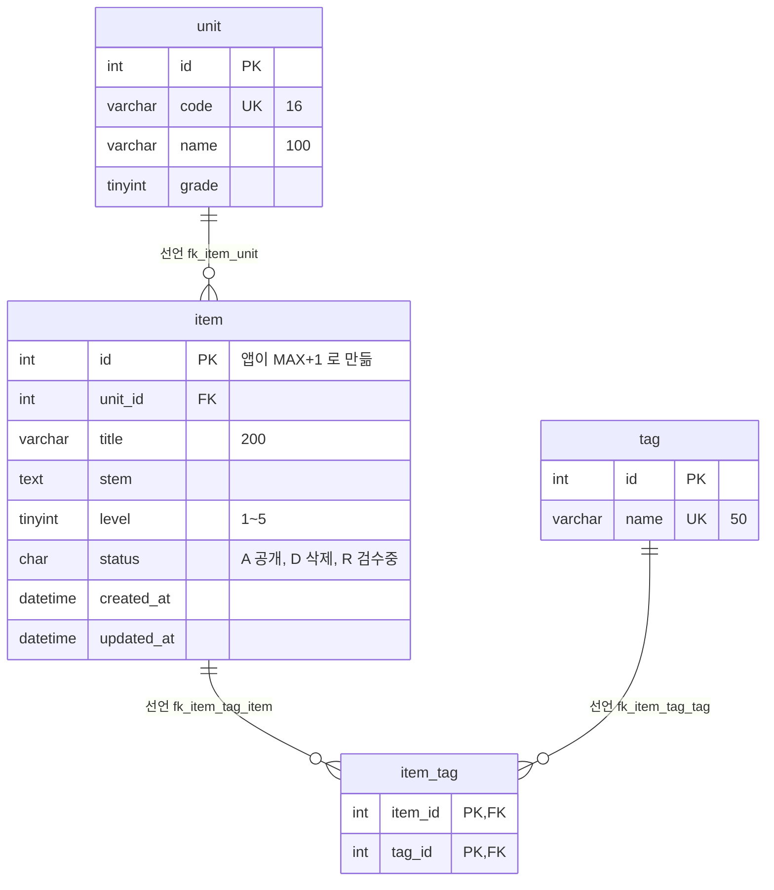
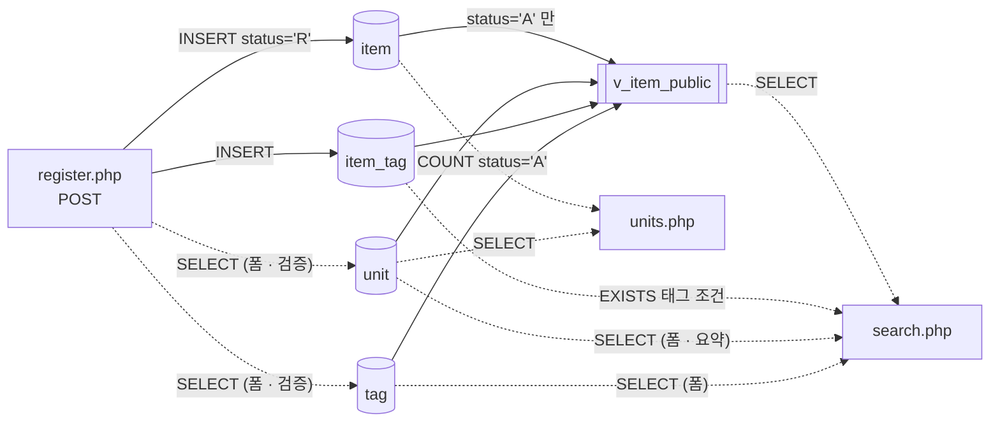

# item-bank-php 데이터 흐름

> 대상: `legacy/item-bank-php` · 분석 범위: 테이블 · 관계 · 읽기/쓰기 위치 · 분석일: 2026-09-29
> 선행 문서: [ARCHITECTURE.md](ARCHITECTURE.md). `vendor/` 는 읽지 않았다.
> 근거는 `파일:줄번호` 이다. PHP 파일은 `legacy/item-bank-php/` 기준, 스키마는 저장소 루트 기준(`db/mariadb/init/...`)이다.

## 0. 스키마 출처

ARCHITECTURE.md 6장 2번에서 "스키마 파일이 모듈 안에 없다"고 적었는데, 모듈 **밖**에서 찾았다.

- `docker-compose.yml:25` 가 `./db/mariadb/init` 을 MariaDB 초기화 폴더로 마운트한다.
- `item-bank` 서비스가 그 `mariadb` 서비스에 `DB_NAME=itembank` 로 붙는다 (`docker-compose.yml:35-45`).
- 테이블 · 뷰 정의: `db/mariadb/init/01-schema.sql`. 시드: `02-seed.sql`. 계정: `03-users.sql`.

같은 스키마 파일에 `class` · `assignment` · `distribution` · `submission` 도 있지만, assignment-thymeleaf 모듈용이고 (`01-schema.sql:73`) item-bank-php 코드에는 나오지 않는다. 이 문서에서는 뺐다. 단, `assignment.unit_id` 는 `unit` 을 참조하는 FK 이다 (`01-schema.sql:89`). 그래서 `unit` 을 바꾸면 다른 모듈에도 영향이 간다.

## 1. 테이블 목록

| 테이블 | 종류 | 주요 컬럼 | 키 · 제약 | 근거 |
|---|---|---|---|---|
| `unit` | 테이블 | `id` INT, `code` VARCHAR(16), `name` VARCHAR(100), `grade` TINYINT | PK `id`, UNIQUE `code` | `db/mariadb/init/01-schema.sql:11-18` |
| `item` | 테이블 | `id` INT, `unit_id` INT, `title` VARCHAR(200), `stem` TEXT, `level` TINYINT(1~5), `status` CHAR(1) 기본 `'A'` (A=공개 · D=삭제 · R=검수중), `created_at` DATETIME, `updated_at` DATETIME | PK `id`, INDEX `unit_id` · `level`, FK `unit_id → unit.id` | `db/mariadb/init/01-schema.sql:20-33` |
| `tag` | 테이블 | `id` INT, `name` VARCHAR(50) | PK `id`, UNIQUE `name` | `db/mariadb/init/01-schema.sql:35-40` |
| `item_tag` | 테이블 (N:M 연결) | `item_id` INT, `tag_id` INT | PK (`item_id`, `tag_id`), FK `item_id → item.id`, FK `tag_id → tag.id` | `db/mariadb/init/01-schema.sql:42-48` |
| `v_item_public` | 뷰 | `id`, `unit_id`, `unit_code`, `unit_name`, `unit_grade`, `title`, `stem`, `level`, `created_at`, `updated_at`, `tag_names`(쉼표로 이은 태그 이름) | `item JOIN unit`, `WHERE i.status = 'A'` | `db/mariadb/init/01-schema.sql:52-70` |

참고:
- `id` 컬럼은 모두 `AUTO_INCREMENT` 가 없다. 그래서 `item.id` 를 애플리케이션이 직접 만든다 (`register.php:87`).
- `item` 의 `level` 1~5 범위와 `status` 코드 뜻은 스키마 주석에만 있다 (`01-schema.sql:25-26`). CHECK 제약은 없다.

## 2. 테이블 관계

관계 셋은 모두 **선언**(FOREIGN KEY)이다. 코드의 JOIN 도 모두 이 FK 와 같은 컬럼으로 잇는다. FK 없이 JOIN 에서만 추정한 관계(**추정**)는 **없다**.

| 관계 | 구분 | FK 선언 | 같은 조건을 쓰는 JOIN · 서브쿼리 |
|---|---|---|---|
| `unit` 1 : N `item` | 선언 | `01-schema.sql:32` | `units.php:17` (`i.unit_id = u.id`), `01-schema.sql:69` (뷰) |
| `item` 1 : N `item_tag` | 선언 | `01-schema.sql:46` | `search.php:245` (`it.item_id = v_item_public.id`), `01-schema.sql:67` (뷰) |
| `tag` 1 : N `item_tag` | 선언 | `01-schema.sql:47` | `search.php:244` (`t.id = it.tag_id`), `01-schema.sql:66` (뷰) |

`item` ↔ `tag` 는 `item_tag` 를 거친 N : M 이다.

뷰 `v_item_public` 은 테이블이 아니어서 다이어그램에 넣지 않았다. `item`(status='A') + `unit` + `tag`(item_tag 경유)를 읽어 만든다 (`01-schema.sql:52-70`).

## 3. 읽기 · 쓰기 위치

"함수" 칸의 `(전역)` 은 함수 밖, 파일 최상위에서 실행되는 코드다. UPDATE · DELETE 는 모듈 어디에도 없다.

### 3.1 `unit`

| 구분 | 파일 · 함수 | SQL | 근거 |
|---|---|---|---|
| 읽기 | `units.php` · (전역) | `SELECT u.id, u.code, u.name, u.grade, (서브쿼리) FROM unit u` — 단원 목록 | `units.php:16-20` |
| 읽기 | `register.php` · (전역) | `SELECT id, code, name FROM unit` — 등록 폼의 단원 선택 목록, 검증에도 씀 (`:61-65`) | `register.php:27` |
| 읽기 | `search.php` · `buildSearchQuery` | `SELECT name, grade FROM unit WHERE code = ?` — 검색 요약에 단원 이름 표시 | `search.php:125` |
| 읽기 | `search.php` · `buildSearchQuery` | `SELECT code, name, grade FROM unit` — 검색 폼의 단원 선택 목록 | `search.php:156` |
| 읽기 (뷰 경유) | `search.php` · `runSearchQuery` | `v_item_public` 의 `unit_code` 로 거르고 정렬 | `search.php:118`, `:295-297`, `:577`, `:600` |
| 쓰기 | 없음 | 모듈 안에 없다. 시드로만 들어간다 | `db/mariadb/init/02-seed.sql:9` |

### 3.2 `item`

| 구분 | 파일 · 함수 | SQL | 근거 |
|---|---|---|---|
| 읽기 | `units.php` · (전역) | `SELECT COUNT(*) FROM item i WHERE i.unit_id = u.id AND i.status = 'A'` — 단원별 공개 문항 수 | `units.php:17` |
| 읽기 (잠금) | `register.php` · (전역, POST) | `SELECT COALESCE(MAX(id), 0) + 1 FROM item FOR UPDATE` — 새 ID 계산 | `register.php:87` |
| 쓰기 INSERT | `register.php` · (전역, POST) | `INSERT INTO item (id, unit_id, title, stem, level, status, created_at, updated_at) VALUES (?, ?, ?, ?, ?, 'R', NOW(), NOW())` — 트랜잭션 안 | `register.php:85`, `:92-101`, `:114` |
| 읽기 (뷰 경유) | `search.php` · `runSearchQuery` | `SELECT COUNT(*) FROM v_item_public WHERE …` → `SELECT id, title, unit_code, level, tag_names, created_at FROM v_item_public WHERE … ORDER BY … LIMIT 20` — 조건 컬럼 `title`, `stem`, `level`, `created_at` | 조립 `search.php:521-526` (`buildSearchQuery`), 실행 `:577`, `:600` |
| 쓰기 UPDATE · DELETE | 없음 | `status` 를 `R → A` 또는 `→ D` 로 바꾸는 코드가 모듈에 없다 (6장 1번) | — |

### 3.3 `tag`

| 구분 | 파일 · 함수 | SQL | 근거 |
|---|---|---|---|
| 읽기 | `register.php` · (전역) | `SELECT id, name FROM tag` — 등록 폼의 태그 체크박스, 검증에도 씀 (`:74-81`) | `register.php:34` |
| 읽기 | `search.php` · `buildSearchQuery` | `SELECT name FROM tag` — 검색 폼의 태그 선택 목록 | `search.php:178` |
| 읽기 | `search.php` · `runSearchQuery` | `EXISTS (… JOIN tag t … WHERE t.name = ?)` — 태그 이름 조건 | 조립 `search.php:244-245`, 실행 `:577`, `:600` |
| 읽기 (뷰 경유) | `search.php` · `runSearchQuery` | `v_item_public.tag_names` | `search.php:521`, `01-schema.sql:64-67` |
| 쓰기 | 없음 | 모듈 안에 없다. 시드로만 들어간다 | `db/mariadb/init/02-seed.sql:19` |

### 3.4 `item_tag`

| 구분 | 파일 · 함수 | SQL | 근거 |
|---|---|---|---|
| 쓰기 INSERT | `register.php` · (전역, POST) | `INSERT INTO item_tag (item_id, tag_id) VALUES (?, ?)` — 고른 태그마다 한 번, `item` INSERT 와 같은 트랜잭션 | `register.php:104-113` |
| 읽기 | `search.php` · `runSearchQuery` | `EXISTS (SELECT 1 FROM item_tag it JOIN tag t … WHERE it.item_id = v_item_public.id …)` | 조립 `search.php:244-245`, 실행 `:577`, `:600` |
| 읽기 (뷰 경유) | `search.php` · `runSearchQuery` | `v_item_public.tag_names` 서브쿼리 | `01-schema.sql:64-67` |
| 쓰기 UPDATE · DELETE | 없음 | 등록한 뒤 태그를 바꾸거나 지우는 코드가 없다 | — |

### 3.5 `v_item_public` (뷰)

| 구분 | 파일 · 함수 | SQL | 근거 |
|---|---|---|---|
| 읽기 | `search.php` · `buildSearchQuery` 가 SQL 조립 → `runSearchQuery` 가 실행 | 건수 쿼리 + 목록 쿼리 (3.2 참고) | `search.php:521-526`, `:577`, `:600` |

### 3.6 흐름 요약

등록된 문항은 `status='R'` 로 들어가고 (`register.php:94`), 검색은 `status='A'` 만 보는 뷰를 쓴다 (`01-schema.sql:70`). 단원 목록의 문항 수도 `status='A'` 만 센다 (`units.php:17`). 그래서 **이 모듈만으로는 새로 등록한 문항이 검색 · 단원 목록에 나타나지 않는다.** R → A 로 바꾸는 곳은 6장 1번 참고.

## 4. 스키마와 코드가 어긋나는 곳

| # | 내용 | 근거 |
|---|---|---|
| 1 | 스키마 주석은 "검색 화면과 등록 화면이 모두 이 뷰를 기준으로 삼는다"고 하지만, `register.php` 는 `v_item_public` 을 쓰지 않는다. `unit` · `tag` · `item` 테이블을 직접 읽고 쓴다 | `01-schema.sql:51`, `register.php:27`, `:34`, `:87-105` |
| 2 | `item.status` 기본값은 `'A'` 인데 등록 화면은 항상 `'R'` 을 넣는다. 기본값이 쓰이는 곳은 이 모듈에 없다 | `01-schema.sql:26`, `register.php:94` |
| 3 | 난이도를 비우고 검색하면 `level < 5` 가 붙어 난이도 5 문항이 빠진다 (ARCHITECTURE.md 6장 6번과 같은 건). 시드 주석은 이 조건을 전제로 건수를 맞춰 두었다 | `search.php:213-215`, `db/mariadb/init/02-seed.sql:34` |
| 4 | `item.id` 에 AUTO_INCREMENT 가 없어 `MAX(id)+1 … FOR UPDATE` 로 만든다. InnoDB 에서 `MAX` + `FOR UPDATE` 가 동시 등록 사이에 ID 충돌을 막아 주는지는 격리 수준 · 잠금 범위에 달려 있고, 이 분석에서 실행해 보지는 않았다 (6장 3번) | `01-schema.sql:21`, `register.php:87` |

## 5. 권한

앱 계정 `app` 은 `itembank.*` 에 모든 권한이 있다 (`03-users.sql:9-10`, `inc/db.php:14-21` → 기본값 `app`). 조회 전용 `readonly` 계정도 있지만 (`03-users.sql:14-15`) 이 모듈은 쓰지 않는다.

## 6. 미확인 목록

| # | 항목 | 이유 · 관련 위치 |
|---|---|---|
| 1 | `item.status` 를 `R → A`(검수 완료) 또는 `→ D`(삭제)로 바꾸는 주체 | 모듈 안에 `UPDATE` 가 없다. 다른 모듈이나 수작업 SQL 인지 확인하지 못했다. `register.php:84`, `:116` 은 "검수 완료 후 검색에 노출"이라고만 적는다 |
| 2 | `unit` · `tag` 를 관리(추가 · 수정 · 삭제)하는 화면이나 절차 | 모듈 안에 쓰기가 없고 시드에만 있다 (`02-seed.sql:9`, `:19`) |
| 3 | 동시 등록 때 `item.id` 가 겹치지 않는지 | 4장 4번. 실행해 보지 않았다 |
| 4 | 운영 DB 스키마가 `01-schema.sql` 과 같은지 | 이 파일은 compose 로컬 환경용이다 (`docker-compose.yml:25`). 운영 DB 는 볼 수 없었다 |
| 5 | `item.updated_at` 을 쓰는 곳 | 등록 때 `NOW()` 를 넣는 것 (`register.php:94`)과 뷰에 싣는 것 (`01-schema.sql:63`) 말고는 읽거나 고치는 코드가 없다 |
| 6 | `item.level` · `item.status` 값 범위를 DB 가 막는지 | CHECK 제약 · ENUM 이 없다 (`01-schema.sql:25-26`). 값 범위는 `register.php:70` 의 검증에만 의존한다 |
